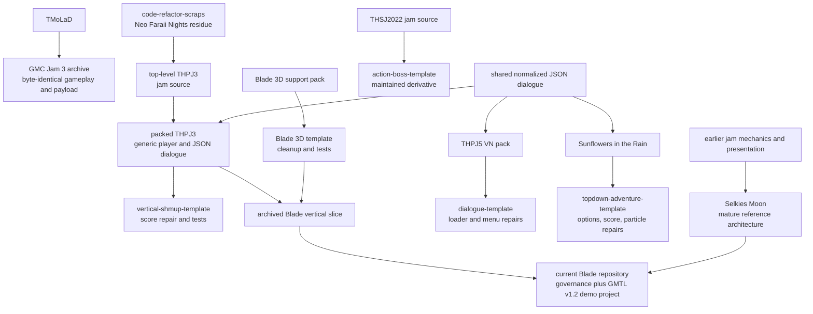

# Corpus Map and Method

## Purpose

This is a read-only archaeology pass over a large collection of jam games, prototypes, libraries, design artifacts, local repositories, and public repositories. Its purpose is to recover behavior and design intent, identify the best-maintained iteration of repeated systems, and propose what should be adapted into the current Blade of Desires repository.

It is not a build audit, a license clearance, or an extraction change. No GameMaker, Unity, Godot, Igor, YoYo Runner, AppImage, or other GUI/runtime binary was launched. No source corpus was edited.

## Evidence method

The pass used:

- `.yyp` resource graphs and `.yy` metadata to establish registered GameMaker resources;
- GML, C#, GDScript, Python, JSON, shaders, timelines, rooms, prefabs, scenes, and configuration for implementation mechanics;
- path-normalized hashes and relative-path comparisons for lineage;
- Git metadata for branch, provenance, authorship, and fork relationships;
- image dimensions and visual inspection for representative art and design-reference files;
- audio metadata for format, rate, channels, and duration;
- headless Quick Look rendering of all eight hydrated Pages documents, backed by ZIP/member inspection and supplementary lossy IWA text recovery;
- rendered inspection of the scanned RTS PDF;
- GitHub's public API for the hosted repository list, fork parents, archive state, licenses, and exact fork divergence.

The reports do not turn a plausible static inference into a runtime fact. In particular:

- a resource appearing in a `.yyp` does not prove its code compiles;
- loose `.gml` or `.yy` files do not prove they are registered or reachable;
- a generated executable does not prove its neighboring source matches it;
- a historical green log does not prove the current files pass;
- a comment or README describes intent, not necessarily current behavior;
- identical resource names do not prove identical code, while identical normalized hashes do.

## Source roots and write boundary

| Corpus | Read scope | Treatment |
|---|---|---|
| GameMaker archive | `/Users/magicalfeyfenny/GameMakerProjects/` | Deep source, content, metadata, and representative asset inspection; caches and outputs only as fingerprints |
| Local repositories | `/Users/magicalfeyfenny/GitHub/` | Read-only repository, history, code, test, and asset inspection |
| Creation archive | `/Users/magicalfeyfenny/Documents/My Creations/gamedev/` | Design documents, preproduction, source art, audio, 3D fixtures, and story formats |
| Public GitHub | `https://github.com/magicalfeyfenny` | Public metadata and source; forks separated from authored deltas |
| Report destination | `/Users/magicalfeyfenny/GitHub/blade-of-desires/docs/archaeology/` | The only new report files |
| Index reference | `/Users/magicalfeyfenny/GitHub/blade-of-desires/AGENTS.md` | One concise link to this archive |

Existing dirty and untracked files in local repositories were treated as user-owned. At audit start, the destination's stale local worktree contained one untracked `project/~ blade of desires ~/~ blade of desires ~.resource_order`; Git collapsed that path to an untracked directory while the then-current `origin/dev@2b8532b` tracked 61 other GMTL project files there. The residual local file was not treated as authority and remains unmodified. This publication branch is based on the later `origin/dev@6b938aa`, which also contains the merged GMTL integrity lock.

## GameMaker archive shape

The top-level archive contains:

- `TMoLaD`, a compact vertical boss game;
- `thpj3`, the original Wriggle-themed horizontal shmup source;
- `thpj5`, an empty directory, alongside a post-jam AppImage that was identified but never executed;
- `blade-of-desires`, an assembled 3D-backed vertical shmup slice;
- `selkies-moon`, the largest and most mature GameMaker architecture;
- `TemplateProjects`, containing preserved packs, normalized templates, shared libraries, a GMTL vendor checkout, conversion tooling, historical test logs, caches, and outputs;
- `fenny-moe`, a static jam catalog;
- `test-sheet`, an empty recent GameMaker project;
- generated top-level `cache` and `output` trees;
- Selkies Moon LFS audit/migration snapshots and a bundle, recorded as migration evidence but not traversed as game source;
- a Python environment, treated as tooling rather than project content.

### Representative resource inventories

Counts are registered resource-directory counts unless a qualification is stated.

| Project | Objects | Scripts | Sprites | Sounds | Fonts | Rooms | Shaders | Timelines | Qualification |
|---|---:|---:|---:|---:|---:|---:|---:|---:|---|
| `TMoLaD` | 29 | 25 | 30 | 7 | 2 | 2 | 0 | 0 | Byte-identical implementation lineage with GMC Jam 3 |
| top-level `thpj3` | 37 | 4 | 72 | 18 | 6 | 4 | 0 | 1 | Original themed source |
| packed `thpj3` | 37 | 4 | 72 | 18 | 6 | 4 | 0 | 1 | Generic player and JSON-dialogue migration |
| vertical shmup template | 37 | 20 | 72 | 18 | 6 | 4 | 0 | 1 | Pack plus GMTL wrappers/tests and score repair |
| packed `thpj5` | 10 | 11 | 32 | 3 | 8 | 6 | 0 | 7 | Populated archived VN source; top-level `thpj5` is empty |
| dialogue template | 10 | 28 | 32 | 3 | 8 | 6 | 0 | 7 | File-loader/menu repairs plus tests |
| Sunflowers source | 42 | 8 | 69 | 15 | 6 | 5 | 0 | 9 | Large authored top-down room |
| top-down template | 42 | 25 | 69 | 15 | 6 | 5 | 0 | 9 | Three script repairs plus tests |
| Neuro Jam 2 pack | 43 | 347 | 46 | 32 | 4 | 6 | 1 | 6 | Includes Input 8.0.3 and Neuro integration |
| archived Blade slice | 42 | 26 | 116 | 18 | 6 | 4 | 3 | 1 | Loose duplicates make disk count exceed canonical graph in places |
| Blade 3D support pack | 6 | 4 | 10 | 0 | 1 | 6 | 3 | 0 | Ambiguous dual `.yyp` authority |
| Blade 3D template | 6 | 21 | 10 | 0 | 1 | 6 | 3 | 0 | Cleaned/test-wrapped support pack |
| Escape Velocity support pack | 3 | 332 | 2 | 3 | 1 | 2 | 0 | 0 | Mostly Input 8.0.3; host layer is incomplete |
| `code-refactor-scraps` | 24 | 10 | 33 | 17 | 5 | 3 | 0 | 1 | Seventy-two loose `.yy` resources are outside the `.yyp` graph |
| `project-crowblade` | 15 | 14 | 18 | 2 | 6 | 5 | 0 | 1 | Several undefined and foreign symbols |
| `magi-charm` | 4 | 5 | 3 | 0 | 0 | 1 | 0 | 0 | Focused movement/camera/interaction prototype |
| Faraii leaf test shmup | 20 | 0 | 9 | 0 | 0 | 1 | 0 | 0 | Forty-one object-event GML files |
| archived GMTL vendor checkout | 2 | 13 | 1 | 0 | 1 | 1 | 0 | 0 | v1.1.1c plus seven historical packages |
| `test-sheet` | 0 | 0 | 0 | 0 | 0 | 1 | 0 | 0 | Empty IDE 2026 schema sample |

These counts describe scale, not quality. A 332-script dependency can be less appropriate than a six-function project adapter; a 106-moment timeline can be less usable than a 12-row data table.

## Major lineage graph

### Exact lineage findings

- `TMoLaD` and packed `gmc-jam-3` contain byte-identical GML and payload implementations. Treat them as one system snapshot with two provenance locations.
- Top-level `thpj3` to packed `thpj3`: 182 GML paths are shared, 146 byte-identical, 36 changed, with the main systematic change being Wriggle-specific player symbols replaced by generic player symbols and the old line format replaced by the shared JSON dialogue runtime.
- Packed `thpj3` to the vertical template: all 190 packed GML paths remain; 189 are byte-identical. The only production-script change is the repaired score loader, followed by test resources.
- Packed `thpj5` to the dialogue template: all 53 GML paths remain; 51 are byte-identical. The production changes repair `scr_files_load` and replace an empty `scr_menu_draw` with an actual menu renderer.
- Sunflowers to the top-down template: all 180 source GML paths remain; 177 are byte-identical. Only options, scores, and particles are repaired before tests are added.
- THSJ2022 to the action template is a maintained derivative: 66 of 68 production GML files are byte-identical, with hardened options/particles and project tests.
- Neuro Jam 2 and Sunflowers are siblings only by archive folder. Their mechanics and source are not iterative versions of one another.
- The archived Blade slice combines the THPJ3 shmup vocabulary with the Blade 3D support/template vocabulary, then rethemes and narrows the field.

## Authority ranking for adaptation

When multiple copies exist, use this order as a starting point:

1. Current repository policy and architecture requirements.
2. Verified dependency boundaries. `origin/dev@6b938aa` contains GMTL v1.2 and its exact fail-closed integrity lock. The imported tree still has no retained notice and carries characterized false-green matcher defects; see [the dependency analysis](gamemaker-3d-libraries-testing.md#dependency-boundary-for-current-blade).
3. Selkies Moon for mature project-owned system contracts and tests.
4. A normalized template when source diff shows a specific repair over its pack.
5. The latest coherent pack for original gameplay behavior.
6. Original jam source for intent, content, and lineage.
7. Loose/orphan resources only as archaeological evidence.
8. Caches, outputs, binaries, and logs only as historical fingerprints.

This ranking is per subsystem. For example, the dialogue template has the best THPJ5 menu renderer, while the packed and template dialogue runtime are byte-identical. The standalone 3D template is the cleaner parser/test baseline, and Selkies is the stronger maintained two-pass-stage contract. The archived Blade slice is a one-shot GDD interpretation useful for feasibility and defect study, not independent product authority.

## Generated outputs and stale evidence

The archive includes approximately 174 MB of top-level GameMaker cache data and 142 MB of top-level output, plus TemplateProjects and project-local cache/output trees. Family names and copied data establish that action, Blade, dialogue, Sunflowers/top-down, THPJ3, THPJ5, and template targets were built at some point. They do not identify the exact matching source commit and do not establish a current successful build.

Stored logs are explicitly historical:

- the archived Blade Igor log dated 2026-04-08 reports 7 pass, 1 fail, and 15 skipped before an internal GMTL error around stale `obj_wriggle` references;
- the archived Blade test-results log dated 2026-04-10 records four suites and 50/50 passing tests, but was not reproduced;
- the Blade 3D template log dated 2026-04-10 reports 17/17 passing;
- the stored template logs report green script-level suites for action, dialogue, top-down, and vertical-shmup templates;
- source files changed after some logs, and no GameMaker runner was invoked during this pass.

## Provenance and ownership boundary

Several categories need explicit review before direct adoption:

- Touhou characters, portraits, names, music references, backgrounds, and derivative fan-game presentation;
- Unity team-repository code and assets without a repository license;
- third-party libraries such as Input and GMTL, which must retain their licenses and be version-locked rather than casually copied;
- public forks that are byte-identical to their upstream parent;
- runtime-only PNG/WAV/OGG assets whose editable sources or authorship are absent;
- mood-board images and staged photos that are references rather than production assets;
- system fonts or audio copied into prototypes without an explicit project-local license statement.

The safest reuse path is usually behavior-level adaptation: write a project-owned contract, preserve the useful mechanic, add deterministic tests, and create or recover compliant source assets.

## Coverage limits

- Static inspection can identify definite missing symbols, malformed references, unregistered files, and suspicious control flow, but not every GameMaker-version compatibility issue.
- The fully hydrated Pages documents rendered complete visible bodies as ordered per-page PDFs. Text extraction plus visual checks retained meaningful layout/status colors; package/IWA inspection supplied cross-checks, not a byte-perfect source conversion.
- Representative visual assets were inspected; hundreds of near-duplicate animation frames were inventoried by family rather than judged one by one.
- Public GitHub metadata was captured on 2026-08-10 and the repository inventory/default-head drift was rechecked on 2026-08-12; it will continue to drift.
- The LFS migration repositories and object maps were deliberately not traversed as gameplay source.
- No destructive action, branch change, commit, push, issue, pull request, or publication was performed as part of the archaeology pass.
