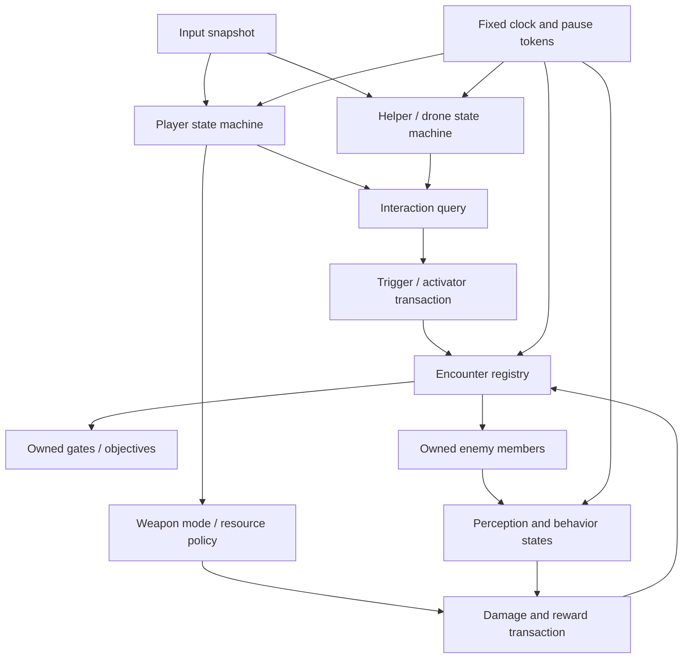

# GameMaker Action, Top-Down, Platformer, and AI Family

## Recommended source hierarchy

| Need | Best archaeological source | Why | Do not copy unchanged |
|---|---|---|---|
| Top-down movement/weapons | Sunflowers pack plus top-down template fixes | Complete jam loop, four weapons, inertia, gates, bosses, cutscenes | 3,000×3,000 hand-placed room, global gate condition, themed content |
| Player/helper traversal | Neuro Jam 2 public source | Distinct grounded, command, flight, interaction, death/retrieval states | Large coupled Step events, mismatched gamepad verbs, unsafe save/API code |
| Encounter trigger vocabulary | Shale Trigger/Activator, Neuro levers/buttons, Sunflowers gates | Clear conditions/effects and persistence intent | Free-form globals, singleton object assumptions |
| Top-down perception AI | Ludum Dare 21 | LOS/FOV, last-known position, search, spatial activation | Collision/state changes in Draw and room-specific globals |
| World/camera transforms | Ludum Dare 23 and Neuro | Camera-local experiment plus lead/look/shake | Multiple competing coordinate spaces and duplicate camera owners |
| Resource-as-environment | Ludum Dare 42 | Water as ammunition and world material | Incomplete damage/collection loop and particle leaks |
| Compact score attack | THSJ2022, Double Jammy, THFGJ7 | Timed goals, mode transitions, charge/volley, restraint | Timeline/XOR defects and hard-coded UI/input |

These games are behavior mines, not subsystem libraries. Their best ideas should become project-owned data/state components behind the deterministic services in [the system blueprint](system-blueprint.md).

## THSJ2022 action lineage

Sources:

- `/Users/magicalfeyfenny/GameMakerProjects/TemplateProjects/gm-packs/action/thsj2022`;
- `/Users/magicalfeyfenny/GameMakerProjects/TemplateProjects/gm-templates/action-boss-template`;
- public `magicalfeyfenny/thsj2022` for original identity/provenance.

Despite the later template name, this is not a reusable boss-rush framework. It is a compact 60-second crowd-control/score-attack game whose character throws a lasso, captures moving targets, and converts the catch into points. The archive's value is the interaction cycle, title/options/dialogue host, and template-maintenance lineage.

The action pack contains 411 files, 70 GML files/2,705 lines, 18 objects, eight scripts, 35 sprites, nine sounds, six rooms, one timeline, and seven fonts. The template has 87 GML files/5,155 lines because it adds GMTL/helpers/tests. Flow is init, disclaimer, title, JSON explainer, 1,280×1,280 arena through a 640×360 view, then victory.

### Gameplay contract

Exact active loop:

1. WASD accelerates by one per frame to speed 6.
2. Hold LMB to grow a mouse-centered lasso from radius 50 to 200.
3. Release LMB to store center/radius.
4. Hold RMB to contract one pixel/frame; a circle-list query gathers enemy-parent instances and removes one HP per frame.
5. Each contraction frame adds `hits / 50` chain and `10 * chain` score per hit; any hit refreshes a 300-frame grace.
6. Release RMB or reach zero radius to clear the lasso.
7. After 300 frames without hits, chain divides by 1.02 each frame and the game timer loses five extra frames per frame.
8. Resolve after the 3,600-frame base timer.

The source uses parent objects and scene/timeline narration around that loop. Its catch operation is a useful explicit transaction candidate: `thrown -> expanding -> closing -> resolved -> cooldown`, with target IDs captured exactly once and a score result emitted separately from rendering.

Rank thresholds 0, 9, 69, 420, 1,234, 2,022, 5,555, 8,008, and 12,345 map to ranks 0–8. Enemy Destroy grants `1 + rank` chain, `100 * chain * rank` score, and one timer frame for any destruction reason; rank-zero kills score zero.

The spawner maintains fewer than `200 + 50*rank` enemies and attempts `1 + rank` spawns per frame outside central ±96-axis bands. Rolls select basic 10-HP enemies, rank-gated Hina 200 HP, Keine 50 HP, or Suwako 100 HP. Insufficient-rank rare rolls simply spawn nothing.

Special crowd-control recipes:

- Hina spins at radius 150 for ten attack frames, rotating 45°/frame; cooldown `360 + random(300)`, with large chain/time reward.
- Keine telegraphs during the last 30 ticks, then charges 90 frames at speed 5/radius 60.
- Suwako samples the player position during timer 90–50, teleports there, and performs a five-frame radius-120 slam; cooldown `720 + random(300)`.
- Attacks set 90-frame invulnerability and knock entities back; there is no active player HP system.

Camera follows 20% toward the player normally, but while building/contracting aims two-thirds at player and one-third at mouse/lasso center.

### Lineage

Public THSJ2022 retains original player naming and jam history. The local pack genericizes the player and replaces older dialogue with the converged JSON runtime. After mapping the player rename, gameplay remains effectively the same; the substantive local evolution is dialogue lifecycle/content migration.

The action-boss template is the maintained derivative: of 70 shared production GML files, 68 are byte-identical. Its two material production changes harden options and particle initialization, and it adds 12 vendored GMTL scripts, two helpers, and three suites declaring eleven tests. Those tests cover the eight production script resources—not object gameplay, orphan events, DS cleanup, or any boss system.

### Static weaknesses

- initialization responsibilities are duplicated across controller paths;
- lasso/special-enemy DS lists and particle resources lack cleanup;
- five player collision files and three enemy shooter-collision files are unregistered/stale, referencing undefined `hp` and absent shooter roles;
- raw keys, object singletons, and timeline coordinates drive the loop;
- template naming overstates the generality of its boss support;
- options input loading retains decode-twice/map leaks;
- enemy Destroy rewards every cleanup reason;
- historical tests do not establish present runtime behavior.

Adapt the lasso as a bounded weapon/state component and a one-shot capture transaction. Do not use the whole template as Blade's boss architecture.

## Sunflowers in the Rain lineage

Sources:

- local pack `/Users/magicalfeyfenny/GameMakerProjects/TemplateProjects/gm-packs/topdown/sunflowers-in-the-rain`;
- cleaned `/Users/magicalfeyfenny/GameMakerProjects/TemplateProjects/gm-templates/topdown-adventure-template`;
- public `magicalfeyfenny/thpj4`, the original themed identity/provenance authority.

The public and local projects are the same gameplay lineage. Public source uses Wriggle/butterfly names and 11 TXT dialogue files; the local pack renames those boss/familiar resources, replaces the 11 texts with JSON/shared dialogue, and adds dialogue cleanup. The six public boss/familiar GML files map exactly after pure renames, while the remaining substantive source differences are dialogue/UI calls. Audio and most same-role image payloads are identical. Public history is best for provenance; the local pack is best for evolved generic/JSON code, although de-theming remains incomplete.

### World composition

`rm_game` is a single 3,000×3,000 map with exactly 65 instances and 1,065 asset placements:

- 31 gates;
- 19 walls;
- five encounter/spawn zones;
- three `obj_cutscene_camera` instances plus one ordinary camera;
- player, UI, dialogue, opening/midboss/boss triggers, and scene controllers;
- 1,063 individually placed sunflower graphics.

This demonstrates a substantial authored jam room, but it is not a scalable world pipeline. Convert interesting composition into tiles, authored chunks, named anchors, and encounter data rather than copying a thousand room placements.

### Player movement and aiming

The player uses eight-direction inertia with speed 6 unfocused and 3 focused. Collision resolves x and y separately against walls. `C` fires; holding `Z` focuses and locks aim while movement direction remains independent. Health starts at 10. Damage gives 90 frames of invulnerability and knockback; death restarts the room.

That separation—movement vector versus aim vector while focused—is useful for Blade ship/option control. It should enter the common input snapshot and player-state pipeline, not live in raw-key Step code.

### Weapon set

| Mode | Behavior | Resource policy |
|---|---|---|
| Default shot | Repeated projectile with randomized angle | Unlimited/default |
| Flame | Sine-stream projectile motion | 500 ammo |
| Radial laser | Eight rays, 20-frame arm, 90-frame life | 50 ammo |
| Homing missiles | Acquire target after a delay and steer | 200 ammo |

Bouncing pickups switch weapon/ammo; hearts restore ten health. The radial laser tests one collision target per ray per frame, so a production beam needs explicit hit cadence, penetration, target ordering, and reason-coded damage.

### Enemy and boss vocabulary

- Chaser: direct pursuit.
- Shooter: aimed shot every 40 frames.
- Large enemy: 250 HP, four three-bullet volleys, then charges a sampled player position; drops a power-up.
- Guardian: 1,000 HP, follows a path, spawns two homing familiars every 420 frames.
- Yuuka: 1,500 HP, path/walk behavior and master spark every 200 frames.
- Master spark: expanding/fading beam with its damaging interval tied to expansion 0..80.

The enemy-shot parent creates a `lifetime`, but its player collision subtracts `hp`, which is not visibly initialized there. Familiar wrap/angle code is also brittle. Treat these as static concerns needing tests, not proven runtime outcomes.

### Encounter gates and cutscenes

Five spawn-zone timelines activate gates, set combat, and spawn waves. Gates begin inactive, reactivate during combat, and deactivate when `instance_number(obj_enemy_parent) == 0`.

That global absence check is the core architectural flaw: every active gate can open when the world has no enemies, regardless of which encounter owned them. The replacement contract is:

```text
encounter ID
  owns member enemy IDs
  owns gate IDs
  declares completion objective
  emits completed once
  opens only its gates
```

Opening, midboss, boss, and final timelines move the player/camera/boss, switch music, enable combat/gates, pause for dialogue, and stage a final master-spark scene. Preserve their beat order as sequence fixtures; replace coordinates and timeline moments with named anchors and explicit wait conditions.

### Template repairs

Only three production scripts change from pack to top-down template:

- options initialization merges known saved keys while retaining defaults and destroys decoded maps;
- score loading closes handles and reads the correct player point field;
- particle initialization falls back from a missing cherry sprite and creates absent particle layers/arrays.

Particle setup remains commented out in the initializer. The template's 17 GMTL/test scripts cover initialization, inputs/options, high score, shared JSON loader, bordered text, and particle setup—not movement, weapons, enemies, bosses, gates, timelines, or the large room.

## Neuro Jam 2: player and drone traversal

Source authority is public/local `main` commit `7bd215bc3981b4cb340ebcb992d10049032d1db1`. The packed copy has identical normalized gameplay GML but is a cleaned/newer-schema subset. The local Git worktree's 109 metadata conversions contain no GML changes and are not a gameplay iteration.

### Reachable world

The six-room order is init, title, test, level 2, level 1, intro, but ordinary code follows:

```text
rm_init -> rm_title -> rm_intro -> rm_level1 -> end lever -> rm_init
```

No next-room teleporter instance is placed, so level 2 and test appear editor/dev content.

Level 1 is 19,200×640 with 415 instances:

- 239 invisible solid blocks;
- 116 spikes;
- 11 doors;
- ten checkpoints;
- nine tutorial-message triggers;
- six levers;
- five crates and five buttons;
- player, loader/dialogue/pause/background;
- four talkables, drone scene, music/intro/end/kill triggers.

The 640×360 persistent camera follows with velocity lead, looks halfway toward the mouse in command mode, clamps to the room, and shakes. A dead-camera branch uses `global.respawn_x` to compute y, a clear axis typo.

### Player states and motion

States are grounded, flying, commanding, dead, and cutscene.

Observed parameters:

- acceleration toward 2.25 pixels/frame;
- gravity 0.3334;
- jump velocity -4, extendable for eight held frames;
- six-frame coyote and jump buffer;
- wall jump horizontal 5 / vertical -6;
- wall slide gravity multiplier 0.1;
- climb speed 1.5;
- stamina 100, draining 0.5/frame while moving on wall and 0.25 idle, recovering 1.5/frame grounded;
- automatic mantle adds 3.5 horizontal velocity.

Pixel-axis resolution tests a global solid collection. The current player Step combines motion, collisions, interaction, drone state, death, animation, input, and save/UI consequences. Preserve the numbers as feel fixtures and split responsibilities into small states/components.

### Command and flight loop

The player can pick up metal crates with interact and hold levers. `V` enters command mode while gravity still affects the player. Mouse hover finds an interactable; interact sends the drone to a line-of-sight-clear object or point, while invalid commands show red feedback and camera shake.

The drone can:

- carry/drop crates;
- latch and hold levers;
- recall to the player;
- be grabbed when within 26 pixels;
- fly the attached player with arrow input up to speed 4;
- transfer momentum into a jump on release;
- retrieve a dead/offscreen player to the latest checkpoint.

Flight drains `0.2 + abs(hsp / 12)` stamina per frame. Navigation is direct interpolation; MP-grid path code exists but is commented, so the drone can visually cross geometry. Player pickup is coupled specifically to `obj_metalcrate` despite a generic interactable parent. `is_heavy` is declared but unused. Momentum release writes `deccel` although creation uses `decel`.

On danger, the player ragdolls and the drone releases work, retrieves the hidden body, and restores it at respawn. This is an excellent diegetic death loop. Before the companion exists, danger code still references it without an existence guard, so production needs an explicit fallback.

### Puzzle contracts

The interactable parent supplies holdable physics, friction, LOS, and highlight behavior. Buttons sense weight above and drive a linked door. Levers rotate toward -90 while held and drive their door. The final slow lever reaches -90, sets endgame, and begins an approximately 200-frame fade.

Extract interfaces:

- selectable/highlightable;
- carriable with weight and owner;
- activator with continuous/discrete value;
- door/gate with stable target ID;
- command target with LOS/navigation policy.

The flash shader retains sampled alpha and replaces RGB with vertex colour. It is a useful silhouette primitive when wrapped in explicit shader/blend-state restoration.

### Checkpoints, save, and API warning

Checkpoint reconciliation, save screenshot, and stable-room intent are discussed in [Dialogue, cutscene, menu, save, and input](gamemaker-dialogue-save-input.md). The current buffer lifecycle can double-delete on repeated saves, has no schema/migration, and does not fully reset data on New Game.

The dormant Neuro Game API object is not placed in rooms and has no callsites. It has path/INI-section mismatches, buffer leaks, wrong cleanup order, malformed unregister data, no success response, duplicate stray send helpers, and undefined references. It is not an extraction candidate. If integration is ever desired, begin from a current protocol/SDK and a separately lifecycle-tested client.

## Ludum Dare action experiments

These small projects are most valuable because each isolates one unusual design idea.

### LD21: perception-driven fortress

`Escape from the Wintry Fortress` has 19 objects, 25 scripts, 22 sprites, eight sounds, five rooms, two fonts, and two tilesets. Its 2,016×2,016 gameplay room contains 662 instances: 616 walls, 34 directionally placed mooks, one player, boss, activator, and HUD, plus eight preplaced hit effects. This is a hand-authored fortress, not a level-data system.

The player starts at 1,000 regenerating health, 14 rounds, and three spare clips. Eight-direction movement turns in 2.5° increments, moves at speed 2, and uses 0.5 friction. Independent direction checks can apply diagonal turning twice. `Z` is release-gated single fire at speed 25. Empty-magazine or `X` reload immediately refills 14 and starts a nominal 50-frame sequence with sounds at 49, 46, 6, and 3.

The reload is not a true lock: its countdown advances only while `Z` is released, and shooting does not check `reloading`, so a manual refill can fire immediately while the timer stalls. Preserve magazine/audio cadence, but model `ready -> reloading -> ready` explicitly.

Mooks have 250 regenerating HP, nominal ±60° vision, wall LOS, remembered coordinates, a 360-frame search timeout, 0.25 pursuit speed, and aimed fire every 15 visible frames. The boss raises HP to 1,000/speed to 2 and fires five-shot volleys every ten visible frames at ±20/±10/0°. The resulting vocabulary is valuable:

```text
inactive -> alerted/visible -> pursue/fire
                     -> lost target -> search last known -> stand down
```

Normal hits deal 100; an unalerted target takes another 100. A supposed point-blank 500 bonus/refund checks enemy-to-player distance under one pixel rather than projectile travel distance. Cone comparisons do not normalize across 0°/360°, lost-sight expressions have fragile negation precedence, and movement to last-known position requires distance over 40 on both axes.

Both projectile types perform collision, damage, destruction, and three-copy trail positioning in Draw, making behavior render-frequency dependent. A view activator enables a region 50 pixels outside the view and deactivates everything else except itself; useful intent, but it can disable managers/HUD without categories. The HUD also moves backgrounds and creates weather particles while drawing.

Adapt perception as deterministic sensor data feeding a pure state transition; move all collision and activation to simulation, with explicit activation groups.

### LD22: pseudo-3D arena

`The Ghost Who Wants to Be Alone` has 26 objects, 38 scripts, 23 sprites, 11 sounds, five rooms, six fonts, and an empty timeline. It uses a converted legacy `d3d_*` layer for a 2,000×2,000 circular arena and 1,024×768 perspective/orthographic drawing.

QWERTY/QWERTZ, AZERTY, and Dvorak layouts accelerate movement by 0.2 to speed 15 with friction 3. Held left mouse emits three randomized cards per frame; right mouse spends a bomb, clears the enemy-manager family, and grants 30 invulnerability frames. The player begins at life 2 but is respawned before decrement, yielding three bodies. Extends occur at `150000 * limit`, then the limit doubles.

Rank is continuous: `sqrt(score / 5000)`. Waves choose spinners, meteors, or bees in four mirrored quadrants. Wave delay is `150 - 5*rank`, but jumps to 30 once below 45. Quantities per quadrant scale by rank: spinners 2/4/6, bees 3/5/10, or one large meteor. The boss alarm is written as `1800 + 600*waveno`, but `waveno` is initialized to zero and never increments in the selected source, so bosses arrive at a fixed 1,800 steps—60 seconds at 30 Hz. `bossno`, not `waveno`, escalates boss HP and projectile count.

Enemies:

- bee: one HP, direct pursuit, base score 20;
- spinner: three HP, pursues but deflects toward nearby cards, score 50;
- large meteor: eight HP/100 score, splits into three medium;
- medium: four HP/50, splits into three small;
- small: one HP/20.

Every enemy Destroy awards score/kills regardless of cause. Bomb, boss transition, player death, and victory cleanup therefore reward; large/medium cleanup also spawns fragments. Multiplier rises after `kills >= 10*(multiplier+1)`. This is another strong reason for explicit defeat versus silent cleanup.

The first boss has 600 HP because `bossno` increments before creation. HP is `500 + 100*bossno`; each boss fires `bossno` evenly spaced projectiles every frame, and victory follows boss six. Spin oscillation -50..50 is updated in Draw, and player collision destroys both actors while boss Destroy still counts victory/progression.

Several `cos`/`sin` calls pass apparent degrees without conversion. Converted D3D allocates global camera/buffer/format without observed cleanup, and many gameplay counters mutate in Draw. Preserve continuous rank, symmetric wave recipes, splitting lineage, boss escalation, and visual composition as fixtures—not the compatibility runtime.

### LD23: camera-local coordinates

`Tiny Girl` has 19 objects, 15 scripts, 17 sprites, 17 sounds, five rooms, one font, and a 92-point smoothed camera path. The 1,500×1,500 world is shown through a 480×320 moving view.

Player/enemies/projectiles store `tagx/tagy` inside screen-local bounds and derive world coordinates by adding the current view origin. Arrows move six pixels; `Z` fires every three frames; `C` reverses firing direction; `X` spends a full bomb. Bomb meter gains 0.2/frame to 100. A 300-frame powerup changes one forward shot to a three-shot fan. The player has three health, 150-frame invulnerability, and score extends at 50k increments.

Mooks enter from a random side every 30 frames; every 300 frames five gunners cross horizontally and fire aimed shots every 60. Boss activation stops further scheduling. Mook/gunner collision awards 250/1,000 plus the shot's generic ten.

All mooks, gunners, and bullets inherit `obj_enemy`, whose Destroy has a 50% powerup drop in a central rectangle. Clearing enemy bullets can therefore drop powerups. Bombs clear that entire family but not the boss.

The flower boss activates after 3,500 frames, fires two aimed bullets every 30 and two separated four-shot fans every 60. It starts at 300 life but dies only below zero, requiring 301 hits. It sets an Alarm 3 that has no event. Victory schedules ending after 300 frames, but high score writes only on the death/restart path, so a winning score is not persisted.

Death/extend counters decrement in Draw and powered-up time runs indefinitely negative. The screen-local design and 92-point route are useful transform/choreography fixtures, but production should choose one logical gameplay space plus explicit camera/render conversion.

### LD42: water as ammunition

`You Have a Fishbowl, Defend It` has ten objects, three scripts, nine sprites, one sound, one font, and two 480×640 rooms. Water is both the movement domain and ammunition.

The Mola moves five pixels only if the target overlaps water and not a barrier. Held `C` emits seven sprays at 69°, 76°, 83°, 90°, 97°, 104°, and 111°, speed 35. A volley sets a three-frame delay, subtracts 0.1 from water y-scale above one, and pushes the fish down 3.2 if unobstructed. Water refills 0.005/frame toward scale 12 while the fish rises 0.08/frame. The shot timer decrements only while `C` stays held, and passive rise ignores collision.

Each generator wave creates ten enemies. `random_range(0,50) < 50` is effectively always true, and next delay uses `60 + (rand ^ 1.5)`, where `^` is XOR, not exponentiation. Popcorn has five HP/speed 4, retargets every frame, and fires every ten after a 50–70-frame delay while above y 400.

Popcorn and bullets inherit the same enemy base. Death checks HP below zero, so five-HP popcorn requires six hits and one-HP bullets require two. An instance/object comparison intended to suppress bullet explosion audio is effectively always true. Enemy bullets have no player collision and no outside-room cleanup; they are shootable but cannot harm the player.

A persistent particle manager recreates particle types across room starts without observed cleanup. The water/ammo/recoil triangle is distinctive, but prototype it independently with conservation, collision, damage, and lifecycle tests.

## Other compact action/score experiments

### Double Jammy / THFGJ11

Local Double Jammy and public THFGJ11 are byte-identical selected implementations. The local archive has 318 files, 132 GML event files/956 lines, 17 objects, no scripts, 22 sprites, nine sounds, four rooms, one timeline, five paths, five fonts, and one tileset. Public differs only by README/resource-order versus local Finder artifacts.

The game is a 60-second archery target score attack:

- A/D acceleration 0.25, speed cap 3; mouse aims.
- Holding LMB freezes movement and charges 0.1/frame to 8.
- RMB banks `charge / 5` into stock capped at 5, although a comment says 3; stock may be fractional.
- Releasing LMB creates `((charge + 1) ^ (stock + 1))` arrows; `^` is bitwise XOR, not exponentiation.
- Arrow speed/spread depends on charge and randomness, with gravity.

The timeline has 79 moments: 78 target spawns and an end controller at position 3,600. Targets are 61 stars, 12 bunnies, and one each of five colored ingredients. They traverse five paths at speed 2: spiral 26 uses, down 15, left/right waves 14 each, U nine. Collision uses an arrow `collided` guard, increments totals/type medals, and fades the arrow for 15 frames. Results report every category, total completion, and an all-target reward; restart unlocks after 300 frames.

GUI Draw correctly derives countdown from timeline position, but GUI Step compares the player's `timeline_index` to 3,000–3,600, so timeout cues cannot track elapsed position. Near-identical target collision handlers, Draw-mutated counters, direct Escape exit, fractional stock, and unlicensed runtime-only Touhou assets remain.

The weapon cadence is useful, but convert charge/store/volley into explicit weapon states with declared integer release counts and data-driven target routes.

### THFGJ7 / THJ7

Public THFGJ7 and local THJ7 differ only in README/provenance material. The local graph has 167 files, 30 GML files/658 lines, 12 objects, five scripts, 25 sprites, three sounds, six rooms, and two fonts. Flow is disclaimer, title, explainer, game, then good/bad ending.

The platform player moves horizontally at 2, holds Up for a variable jump up to ten frames with `vsp = -4 - 0.1*jumptime`, unlocks double jump on release, crouches/fast-falls with Down, and fires every four frames while the encounter is active.

Encounter phases:

1. Mystia approaches for 120 frames.
2. Active shooting lasts 3,600; she moves randomly at speed 6 and reflects from bounds.
3. A “WHEN” cue stops ordinary action and creates the restraint marker.
4. A 600-frame grace/outro follows.
5. Positive score selects good ending; zero/negative selects bad, then waits 100 frames.

Ordinary shots add one. Post-cue shots subtract 20. Display scale is `1 + score*0.005`, so repeated violations can make it zero/negative, even though only score sign controls outcome. The explainer lasts 1,200 frames and holding C advances its skip counter ten/frame.

The input/options loaders double-decode/leak maps; particles lack cleanup; debug state is always drawn; dash/backstep/meter macros are unused; ending rooms lack direct retry; assets are runtime-only Touhou material with no detected license/master.

This is a good two-act run-structure seed: goals, scoring rules, and available actions change at a declared cue. Express approach→active→cue→grace→result as encounter data rather than singleton mode switches.

### Twinblade

Twinblade Infinity contains 484 files, 110 GML files/1,532 lines, 21 objects, 30 scripts, 22 sprites, six sounds, two rooms, one timeline, and five fonts. It is a survival/escalation shooter in a wrapping 2,048×2,048 arena through a 640×480 camera.

Player friction is 0.5; Left/Right rotate ±5°, Up/Down thrust ±9, mouse hold moves toward cursor outside 20 pixels, and both axes wrap. End Step automatically emits two beams every frame at direction ±random 5°, creating the continuous twin-shot identity.

The controller starts level 1, HP 2,400, and regenerates one/frame to `hplvl*25*12`; `hplvl` is fixed at 8. Level changes after `900 + 50*level` active frames and awards `5000*ceil(1.75*level)`. Four corner spawners use interval `ceil(300/level)` and cap enemy descendants at 11.

Level-gated roster:

- buzzsaw level 1: HP 3, chase speed 6, drains seven/frame inside 32;
- beamer level 2: HP 20, ±5° steering, fires every five inside 250;
- nova level 3: HP 100, charges 200, then rotating eight-way volleys;
- drain level 4: HP 100/speed 4, drains five player and one self HP/frame inside 125;
- mother level 5: HP 250/speed 5, rapid random aimed shots, shielded frames 450–599 of a 600 cycle.

One inventory slot holds Nova (300-frame six-beam rotating fan), Shield (300), Restore (+1,000 HP), or Hyper (300; beam damage 1→5). Every 1,800 frames the drop alarm creates all four items simultaneously, and uncollected items persist. Music switches at timeline positions 0, 830, 1,960, 3,060, then stops at 4,270.

Draw mutates restart/particle/counter state; `hplvl` never advances; `dragon_left` is dead; effect timers run negative; drops accumulate; damage is specialized/global-heavy; game-over auto-restarts after 20 Draw frames despite its prompt. Audio includes four raw MIDI tracks and very old low-rate mono WAVs, with no detected editable-master/license authority.

The one-slot choice is valuable: acquiring a new item is an explicit replace/decline/swap transaction. Preserve the unlock roster, twin-shot feel, Nova fan, and level bonus as data; apply arena wrap once in movement and cap item ownership.

## Small movement prototypes

### Magi Charm

Four objects and five scripts implement eight-direction movement with y multiplied by 0.75, axis-separated collision, a forward interaction probe/wedge, and a smooth zooming camera. The room uses 65 walls plus 65 compatibility graphics. Legacy `__view_*` code is scaffolding, not a feature.

Preserve the anisotropic movement and forward interaction wedge as feel/geometry tests.

### Project Crowblade V3

The prototype experiments with platform movement, save/menu/dialogue, UI, and cutscenes, but it is statically incoherent: undefined menu resolution choice; undefined player state constants; references to missing Cirno resources; empty timeline moments; commented collision correction; and 22 loose/unregistered YY resources.

Mine individual sketches only. It is not a base project.

## Unified adaptation model



Rules:

- stable IDs connect content, never editor instance order;
- every interaction resolves once and emits a typed result;
- every encounter owns its members and gates;
- movement and simulation never occur in Draw;
- world positions remain logical; camera transforms are presentation;
- helper navigation obeys the same collision/world model as players;
- weapon resources and environmental resources have audited conservation;
- input/device mappings are validated before play;
- dialogue/cutscene/pause acquire tokens instead of toggling timelines globally.

## Characterization tests to preserve

1. Sunflowers eight-direction/focus movement and axis collision at corners.
2. Every weapon's ammo cost, lifetime, hit cadence, target order, and cleanup.
3. Encounter A cannot open encounter B's gate when the global enemy count reaches zero.
4. Neuro coyote, buffer, wall jump, climb drain/recovery, mantle, flight drain, and momentum release at fixed ticks.
5. Drone commands reject blocked/stale targets and navigate without crossing solids.
6. Death before/after companion acquisition has a defined recovery route.
7. Button/lever/door IDs load deterministically and preserve continuous activation state.
8. AI LOS/FOV transition records last-known position and exits search predictably.
9. Camera world/screen conversion round-trips while moving and shaking.
10. Water/charge/ammo economies conserve resources and reject negative/duplicate spends.
11. Timed score attacks end once, resolve final score once, and ignore post-end captures.
12. No gameplay state changes during Draw; a second Draw in the same tick is idempotent.
