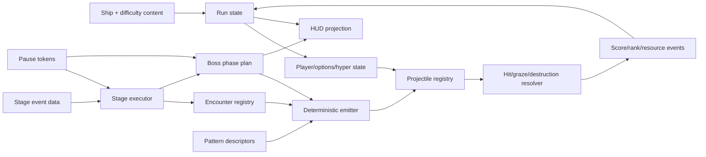

# GameMaker Shmup, Stage, Boss, and Scoring Family

## Family map and preferred authorities

| Lineage | Original authority | Maintained/reusable authority | Central contribution |
|---|---|---|---|
| TMoLaD / GMC Jam 3 | Project identities differ; selected GML and payload are byte-identical | Characterize then rewrite | Compact vertical boss game and ten-phase encounter |
| GMC Jam 7 | Archived action pack/public lineage | Characterize then rewrite | Light/dark polarity, rank, boss patterns |
| THPJ3 | Public/local `4545a9a` | Packed THPJ3; vertical template for score fix/tests | Focus/options/hyper/deathbomb, 13 emitters, staged bosses |
| Archived Blade | `ai-gen-test@a5fc25a` for one-shot semantic history | Vertical and 3D templates plus current policy | Feasibility/defect evidence for profiles, schedule shape, and 3D/2D integration—not current roles or tuning |
| Faraii Leaf | One-room prototype | Characterize then rewrite | Tap-versus-hold weapon morph, line laser, batched glow |
| Selkies Moon | Tracked selected graph/current docs | Mature culmination | Data-authored route contracts, bullet factory/director, boss phase plans, practice/tests; ambient RNG remains |

The lineage shows repeated convergence around the same useful boundaries:

- player profile and run economy;
- emitter/pattern description;
- projectile lifetime/collision/graze;
- enemy ownership and reward;
- stage sequence and encounter membership;
- boss mode/phase plan;
- UI projection of score, lives, bombs, meter, rank, phase, and timeout.

Older games implement those boundaries through objects, globals, timelines, and Destroy events. Blade should express them as data plus small state/services.

## TMoLaD and GMC Jam 3

Sources:

- `/Users/magicalfeyfenny/GameMakerProjects/TMoLaD`;
- `/Users/magicalfeyfenny/GameMakerProjects/TemplateProjects/gm-packs/archive/gmc-jam-3`.

These are not merely similar games: normalized comparison found the selected GML implementation and relevant content payload byte-identical. Keep the distinct project/jam identities for provenance, but count the behavior once.

### Project shape

TMoLaD contains 481 files; the archive copy 483. Both have 111 byte-identical GML files/2,169 lines, 29 objects, 25 scripts, 30 sprites, seven sounds, two fonts, and two rooms. Of 479 common paths, 366 are byte-identical and 113 differ only in project/options/resource metadata. The design is a compact vertical boss encounter rather than a general campaign template.

The object model includes player/player-shot and enemy/enemy-shot parents, boss roles, effects, UI/controllers, and a phase-driven main opponent. Inheritance supplies much of collision, damage, and draw behavior; macros/scripts carry shared tuning.

The 1,024×768 title offers Start, Help, and Exit; `Z` selects. Difficulty is Easy=1, Normal=2, Hard=3, LOL=4, default Normal.

Player behavior:

- arrow speed 5 and Shift-focus speed 2;
- `Z` fires every three steps;
- each volley creates nine shots: central red, two straight, and six sides whose angles change under focus;
- initial invulnerability is 300 steps;
- `global.life` starts at 2;
- death creates an expanding/fading effect that respawns after 20 Draw frames according to remaining stock.

### Boss ladder

The primary boss starts at 25,000 HP and advances through ten alarm-driven phases at thresholds:

```text
22,500 -> 20,000 -> 17,500 -> 17,000 -> 14,000
       -> 12,000 -> 9,000 -> 6,000 -> 4,500 -> 0
```

Alarm 11 waits for hard-coded dialogue, then control proceeds through alarms 10, 9, 0, 1, 2, 3, 4, 5, 6, and 7. At every transition the controller pins HP to the threshold, clears the boss-bullet family, grants one life, plays the attack-complete sound, and schedules the next phase. While untouchable, it restores HP from `prevhp`.

Phase code changes constrained random movement targets, shot selection, timing, and pressure. Recipes include slow decelerating/random shots, mirrored spirals/fans, radial rings, aimed speed-9 streams, border spawns with speed ladders, converging lanes, twin rotating 15-shot fans, decelerate-then-burst bullets, and a final composite. The final phase halves rank and concurrently schedules five attack alarms at 10, 500, 1,000, 1,500, and 2,000 steps.

This makes the project an unusually concentrated source of phase pacing:

```text
enter/position
  -> phase setup
  -> movement + emitters + timer/HP condition
  -> clear/transition feedback
  -> next phase
  -> final defeat/result
```

The HUD exposes ten named attacks, from “Ripples of Humanity on the World” through “Encroachment of Chaos' Will.” The useful extraction is a ten-row characterization table—phase ID/name, HP, timeout, movement command, emitter command, transition cleanup—not the inherited event graph itself.

### Static concerns

- globals mix run, UI, boss, and player state;
- inheritance makes the actual damage/reward path harder to audit;
- HUD Draw mutates phase/game-over state, and difficulty case 1.5 falls through for lack of `break`;
- dialogue Draw resets boss HP to 25,000 every frame while present;
- phase formulas are embedded in scripts/object events rather than validated content;
- generic destruction and room transitions do not carry explicit cleanup reasons;
- direct keys and frame counts prevent input abstraction/replay.
- help claims eight patterns although code/HUD implement ten;
- each bullet-11 creation resets shared `global.qwerty`, and concurrent final attacks share globals, making event/instance order observable.

The game is excellent boss-beat evidence. It is not a production base without exactly-once damage/reward ownership, deterministic emitters, and phase data.

## GMC Jam 7 polarity shooter

Source: `/Users/magicalfeyfenny/GameMakerProjects/TemplateProjects/gm-packs/archive/gmc-jam-7`.

`Split Balance` contains 306 files, 96 GML files/2,756 lines, 21 objects, 31 scripts, 23 sprites, 19 sounds, four rooms, and three fonts. The 800×600 flow is start, tutorial, game, credits.

The distinctive mechanic is a light/dark polarity system: attack and target channels affect whether a hit damages, is ignored, or contributes to the score/rank loop. Boss patterns and player choice are coupled to the current channel, making readability and symmetric resolution central.

Player behavior:

- arrows select eight directions; a heading change resets proportional charge, which recovers 0.2/frame to 1 and yields speed `10*charge`;
- `C` toggles polarity;
- `Z` initiates three volleys, each firing five shots every two steps: three straight/two angled;
- bomb charge gains 0.1/frame to 100;
- `X` at 25+ spends 25 and creates a 15-step bomb;
- every bomb step deals five to all enemies, clears both bullet polarities, and awards ten per cleared bullet.

### Valuable contracts

- one explicit player polarity;
- projectiles carry a polarity/damage channel;
- targets declare vulnerable/resistant channel behavior;
- UI communicates current channel and score/rank consequence;
- boss phases deliberately combine channel pressure with spatial patterns;
- rank increases pressure and/or reward as the player succeeds.

### Static defects and residue

The two damage channels do not apply invulnerability symmetrically, so one route can bypass or extend protection differently from the other. Stage-five material remains as incomplete/residual content rather than a coherent reachable sequence. Globals, raw input, and embedded boss patterns remain typical jam coupling.

Exact asymmetry: light bullets check invulnerability, set it to 120, and play the hit sound; dark bullets check only player polarity and neither check/set invulnerability nor play the sound. Opposite polarity player shots damage ordinary enemies; bosses set `light=2`, making both shot channels effective.

Score gains ten every Step outside dialogue. Rank is `ceil(sqrt(score / 10000))`; its initial zero can feed formulas that divide or scale by rank. Stages cycle 1→2→3→4→1, leaving implemented stage-five music/art/rendering unreachable. Their pseudo-3D vocabularies are conical forest, crystal corridor, block corridor, rotating asteroid/star tunnel, and layered stars/crystal cylinders. Island destruction and scroller rotation occur in Draw.

Boss HP by stage is 1,000 / 1,250 / 1,500 / 1,750 / 2,000. A 654-line Step event selects HP-band patterns—dual-color spirals, random-origin bursts, aimed spreads, accelerating/decelerating shots, and rotating rings—with cadence/count/speed scaled by rank. Defeat awards `100000 * stage` and advances the stage. High score writes only through Escape, and no converted-3D allocation cleanup was observed.

Adapt polarity as a typed damage-channel matrix owned by the hurt resolver:

```text
(source faction, source channel, target faction, target channel, target state)
    -> reject | absorb | damage | amplify | convert
```

The result should be one transaction that applies invulnerability identically unless a content rule explicitly overrides it.

## THPJ3 horizontal/side-scrolling shmup lineage

Sources:

- original themed source `/Users/magicalfeyfenny/GameMakerProjects/thpj3` and public/local `thpj3@4545a9a`;
- generic/JSON pack `TemplateProjects/gm-packs/shmup/thpj3`;
- maintained `TemplateProjects/gm-templates/vertical-shmup-template`.

Original to pack: 182 shared GML paths, 146 byte-identical, 36 changed, seven original-only and eight pack-only. Most path differences systematically replace Wriggle-specific player/cutscene objects with generic player names and add dialogue cleanup. The major subsystem change is six-line TXT dialogue to the converged JSON runtime. Pack to vertical template retains all 190 pack GML paths; 189 are byte-identical and the only production change is repaired score loading, with 16 GMTL/test scripts added.

The later `vertical-shmup-template` name is misleading: gameplay still shoots right across the side-scrolling 1,280×720 stage. The archived Blade integration is the lineage member that actually retargets the system into a narrow vertical lane.

### Room and scene flow

```text
rm_disclaimer -> rm_title -> rm_cutscene -> rm_stage1
```

The 1,280×720 stage uses separate GUI, controller, enemy, player-shot, and background layers. Parallax ground, front/mid/back forest, moon, stars, and sky scroll at distinct rates.

The graph includes:

- player, options, shots, bombs, UI, and stage controllers;
- six enemy-bullet shape objects: ball, bead, blade, card, diamond, pellet;
- enemy parent, popcorn enemy, and five fairy pattern roles;
- boss parent, four-phase midboss, eight-phase final boss;
- title/cutscene/end/dialogue controllers.

### Player and run economy

Observed defaults:

| Parameter | Value |
|---|---:|
| Bounds | x 32..1248, y 132..656 |
| Spawn | 120, 360 |
| Lives / bombs | 3 / 3, bomb cap 5 |
| Focused / unfocused speed | 2 / 5 |
| Deathbomb window | 40 frames |
| Respawn / invulnerability | 60 / 120 frames |
| Volley delay | 3 frames |
| Main shot damage / speed | 5 / 20 |
| Option shot damage / speed | 1 / 20 |

Arrow movement is normalized; Shift focuses. Both `Z` and `C` shoot right, residue from an abandoned dual-direction idea. Two options sit forward with upper/lower separation; focus contracts their vertical separation from 100 toward 20. Every third frame the player emits two main shots and eight option shots in fans.

Hyper accumulates passively and from hits/graze/kills, spans 0..300, and spends into tier 1–3. Duration is `240 + 60 * tier` in the source's gauge-derived policy. Hyper increases player damage/scale but also accelerates enemy timers and bullets; it is deliberately a risk/reward pressure amplifier.

`X` bombs unless enough hyper selects hyper. During the 40-frame emergency window, the response branches in priority order. If at least one hyper gauge is available and hyper is inactive, it consumes the entire current hyper amount, grants tier-3 hyper for 420 frames, and uses a 60-frame bomb/invulnerability gate. Otherwise, if any bombs remain, it consumes all bombs, creates the deathbomb field for 300 frames, and grants 360 frames of invulnerability without granting tier-3 hyper. On ordinary death: lose a life, reset bombs to three, add hyper, halve multiplier, respawn. Zero lives records score and returns to title.

Bombs apply two damage to all enemies every Step for 180 frames; deathbomb lasts 300. This “global damage every tick” behavior needs a declared cadence and damage source rather than an unbounded object scan.

### Thirteen pattern families

`scr_pattern_fire` is a 234-line constructor switch:

1. stream;
2. aimed wave;
3. three-speed shotgun;
4. speed-stacked lane;
5. random burst;
6. ring;
7. random-position ring;
8. horizontal wall;
9. vertical wall;
10. forward random spray;
11. lane-ring;
12. shotgun-ring;
13. stream-ring.

It assumes literal layer `enemy` and singleton `obj_player`. Hyper tiers change counts/spread and give bullets negative friction `-0.02 * tier`, which accelerates them.

The vertical-template tests preserve representative spawn cardinalities:

| Pattern fixture | Expected count |
|---|---:|
| Stream tier 0 / tier 2 | 1 / 3 |
| Aimed wave tier 2 | 9 |
| Shotgun tier 1 | 15 |
| Lane tier 3 | 11 |
| Random burst tier 2 | 12 |
| Ring tier 2 | 24 |
| Random ring tier 2 | 30 |
| Horizontal wall tier 3 | 13 |
| Vertical wall tier 2 | 14 |
| Spray tier 1 | 9 |
| Lane-ring tier 1 | 161 |
| Shotgun-ring tier 2 | 168 |
| Stream-ring tier 3 | 30 |

These are exceptionally useful golden fixtures. The implementation should become a deterministic emitter executor over declarative descriptors, with an emitter owner, target snapshot, RNG stream, layer/space abstraction, spawn budget, and reason-coded cleanup.

### Enemy and bullet lifetime defects

Concrete enemies start at 10, 60, 100, 120, 140, and 700 HP and speed their timers by `1 + hyper_tier`.

Two important scoring flaws must become regression tests:

- bullets have no per-player `grazed` flag, so remaining within 64 pixels repeatedly grants hyper/score/sound every frame;
- bullet Destroy always grants score, including offscreen exit, bomb clear, dialogue cleanup, and room cleanup.

Enemy death/Destroy behavior similarly needs exactly-once reward ownership. Generic cleanup should never imply a kill.

### Boss mode and phases

The boss parent runs:

```text
APPROACH -> CHAT -> CHARGE (120 frames) -> ACTIVE
```

Spawn clears ordinary enemies/bullets and pauses the stage timeline. Dialogue derives a filename from stage/boss identity. HP depletion clears bullets and advances phase; final Destroy resumes the stage timeline.

The midboss has four phases with 2,000 / 2,500 / 3,500 / 3,000 HP, combining random rings/lanes, orthogonal walls/shotgun, aimed waves/lane, and stream/burst.

The final boss has eight phases with 3,000 / 3,400 / 3,500 / 3,100 / 3,000 / 4,200 / 5,000 / 6,500 HP. Its sequence uses lane-rings, rings, vertical walls/spray, shotgun/random rings, stream-ring/burst, shotgun-ring, lane combinations, and finally randomized pattern selection.

This explicit boss-mode/stage-pause handshake is the strongest reusable contract in the original. Replace timeline pause toggles with a token, content-derived filename construction with stable dialogue IDs, and Destroy-based resume with an explicit completion transaction.

### Stage timeline

`tl_stage1_logic` contains 106 moment files with waves through moment 10,001. It choreographs corner popcorn, columns, aimed lanes, shotgun rows, rings, a midboss sequence, and final boss.

Notable residue includes multiple midboss moments (1619, 1859, 1969, 2300), final boss at 3090, congratulations at 3100 and again at 4159, late waves at 4160/4161, and moment 10001. This is cadence evidence, not canonical stage data.

### Score implementation choice

Original/pack scoring has fragile multiplier decay and file handling. Pack `scr_scores` can leave high score undefined and omit a file close. The vertical template initializes high score to zero and closes the read handle; it is the only preferred implementation of that script, but the production score service should still be redesigned around typed reason events and atomic profile persistence.

## Archived Blade integration slice

Sources:

- `/Users/magicalfeyfenny/GitHub/ai-gen-test@a5fc25a` as one-shot semantic/history authority, not independent product or tuning authority;
- `/Users/magicalfeyfenny/GameMakerProjects/blade-of-desires` as a metadata-converted archive with semantically identical GML;
- vertical and Blade 3D templates as cleaner component references.

The slice scales the logical game to 640×360 with a centered 270×360 lane at x 185..455. Perspective scenery is rendered first; gameplay/UI returns to orthographic space. [3D details are reported separately](gamemaker-3d-libraries-testing.md).

### Title/run flow

```text
disclaimer (240 frames)
  -> title: ship + difficulty + settings
  -> cutscene dialogue + UFO transition
  -> scripted stage schedule
  -> midboss -> final boss -> clear bonus -> title
```

The selected graph has 115 sprites, 18 sounds, six fonts, 42 objects, 26 scripts, three shaders, four rooms, and one timeline. `scr_initialize` is a 779-line composition-root monolith that defines profiles, globals, STG bootstrap, 3D helpers, settings, coordinate conversions, and stage schedule.

### Difficulty profiles

| Mode | Bullet speed | Enemy HP | Boss HP | Rank gain | Rank cap | Score multiplier |
|---|---:|---:|---:|---:|---:|---:|
| Breeze | 0.9 | 0.9 | 0.88 | 0.5 | 2 | 1.0 |
| Arcade | 1.0 | 1.0 | 1.0 | 0.85 | 3 | 1.15 |
| Storm | 1.15 | 1.12 | 1.18 | 1.2 | 4 | 1.35 |
| Extra | 1.25 | 1.25 | 1.3 | 1.35 | 4.5 | 1.5 |

### Ship profiles

The profile records focused speed first and unfocused speed second, matching the player's focused/unfocused branch.

| Ship | Focused / unfocused speed | Main / option damage | Forward | Side pair | Arc pair | Turn | Hyper drain |
|---|---|---|---:|---|---|---:|---:|
| Maynii | 2 / 5 | 5 / 1.2 | 96 | 14 / 70 | 9 / 20 | 3 | 1.0 |
| Ciela | 2.3 / 5.2 | 4.5 / 1 | 110 | 18 / 54 | 5 / 12 | 9 | 0.95 |
| Kolar | 1.8 / 4.7 | 6 / 1.8 | 118 | 12 / 34 | 0 / 6 | 1 | 1.15 |

This is useful schema vocabulary: movement, primary/secondary power, option geometry, turn behavior, and meter efficiency belong in validated ship content. The generated values and role implications are not current Blade defaults; Maynii's tracking/forward all-rounder role, Ciela's spread role, and Kolar's deliberately unresolved role come from current product decisions and new playtesting.

### Active stage schedule

| Frame | Event |
|---:|---|
| 60 | Three popcorn enemies |
| 180 | Lane pair |
| 330 | Wave plus shotgun |
| 480 | Four popcorn enemies |
| 660 | Burst |
| 840 | Large ring |
| 1020 | Midboss |
| 1320 | Wave plus burst |
| 1530 | Shotgun pair |
| 1740 | Four lanes |
| 1980 | Two large rings |
| 2280 | Final boss |

Stage time/rank/scroll pause for dialogue, boss, and clear. Rank increases every 180 active frames. The compact list is easier to characterize than the retained old 1,280×720 timeline, which is unused and has orphan moments, but its twelve events are not Blade stage authority. Author Stage 1 anew from the GDD, current decisions, independent pacing evidence, and playtesting; retain only the data-shape lesson.

### Competing state and score defects

`global.bod_run.stg` / `STG_data` is initialized and used mostly by tests, while actual gameplay still uses `obj_player`, global timers, and singletons. `init_STG()` assigns an undeclared `data`. Choose one run-state owner; do not preserve both vocabularies.

Enemy Step awards score on zero HP and enemy Destroy awards again; bullet Destroy awards regardless of cause. Dialogue, boss clear, offscreen exit, and room cleanup can therefore reward or double-reward. This is the clearest archive evidence for a reason-coded destruction ledger.

### Dialogue and content reachability

Five JSON files contain 54 ADV frames, but only the ten-frame cutscene is demonstrably called. Boss dialogue names derive from stage plus displayed boss names `Petal & Briar` and `Asahi`, while files retain Byakuren/Nue identities; 44 frames are statically unreachable through that lookup. Stable scene IDs and a reachability validator must replace dynamic resource-name construction.

## Faraii Leaf weapon-mode prototype

Path: `TemplateProjects/gm-packs/prototype/test-shmup` (`faraii-leaf.yyp` is at that root).

One 640×360 room, 20 objects, nine sprites, 41 GML event files, and no script resources implement a focused experiment.

### Tap versus hold

The player stores a rolling nine-frame shoot-input history:

- a tap or unstable history fires a wide nine-shot fan every three frames plus an alternating-delay forward rack;
- nine identical held frames switch to focus/laser mode;
- held mode slows movement to 40%, creates navy max-blend afterimages, and extends a vertical line laser upward by 20 pixels/frame toward -500.

This is a strong modality idea because the transition is inferred from temporal input rather than a separate focus button. Production should expose the threshold and resolve it through the action snapshot, with fixtures for taps, holds, dropped frames, and release hysteresis.

### Laser and layered world

The laser rectangle-tests flying enemies every frame for five damage and retracts its visible tip to the nearest hit y. A line test at the tip can reveal/destroy hidden ground bees, which additive-flash and drop a collectible.

Ground objects store local offsets then add an environment object's position. That environment drifts 0.25/0.1 each frame, cheaply separating a grounded layer from flying gameplay. Six colour schemes can crossfade over 200 frames, although no in-scope stage trigger selects them.

### Glow and generator

One controller caches enemy bullet IDs and batch-draws rotating additive auras; stale IDs remain but are checked with `instance_exists`. This is a useful batching/effect reference if the registry owns add/remove events and restores draw state.

The enemy generator creates one aimed enemy every frame with no cap. `global.rank` starts at zero and is never changed. Flying/ground/collectible/boss bases are mostly placeholders; no complete danger/lives/progression loop exists. Do not mistake the striking weapon prototype for a complete shmup architecture.

## Selkies Moon as culmination

[The Selkies report](selkies-moon-reference.md) covers the mature implementation. For this family, its main role is to show how the jam ideas evolved:

- centralized frame/state ownership and stable input snapshots; fixed-step simulation, RNG ownership, and replay determinism remain adaptation requirements;
- content-authored routes, segments, seams, encounter directives, and stable IDs;
- bullet factory/type registry and collision director;
- bounded difficulty/rank director with reasoned pressure changes;
- boss phase-plan expansion and difficulty variants;
- practice, replay-like fixtures, and broad GameMaker tests;
- explicit UI/debug/content layers.

Prefer those contracts where they are already project-owned and current. Use the jam archive to recover feel, pattern vocabulary, and alternate mechanics—not to regress to global timeline architecture.

## Combined production architecture



### Required invariants

- stage, boss, and dialogue pause tokens compose without accidental resume;
- every projectile has stable owner/faction/emitter/reason metadata;
- every graze is once per intended player-projectile relationship;
- every enemy defeat rewards once, while cleanup never rewards;
- every emitter uses declared RNG and spawn budget;
- every boss phase has an explicit completion reason and cleanup policy;
- score/rank/hyper mutations pass through typed events;
- render and Destroy events do not own gameplay outcomes;
- stage anchors and content references validate before play;
- practice and replay use the same runtime code/data as ordinary play.

## Characterization tests to carry forward

1. All 13 THPJ3 pattern cardinality fixtures, plus deterministic position/velocity hashes.
2. Graze remains once when a bullet stays inside the radius for many frames.
3. Kill, timeout, bomb clear, dialogue clear, offscreen, and room exit produce distinct destruction reasons and reward counts.
4. Deathbomb accepts exactly the declared window, spends the declared resource once, and cannot also process ordinary death.
5. Hyper tiers alter player and enemy pressure exactly as content declares.
6. Ship profiles produce expected speed, option geometry, volley count, damage, and drain.
7. Stage events occur at active ticks and remain paused under boss/dialogue tokens.
8. Boss approach/chat/charge/active and every phase transition clear/retain the declared entities.
9. Dynamic dialogue IDs are validated; every packaged scene is reachable or explicitly development-only.
10. Faraii tap/hold classification and laser nearest-hit geometry are deterministic.
11. Polarity channels apply invulnerability and reward symmetrically.
12. A repeated Draw or cleanup call cannot mutate score, rank, HP, phase, or projectile registry.
