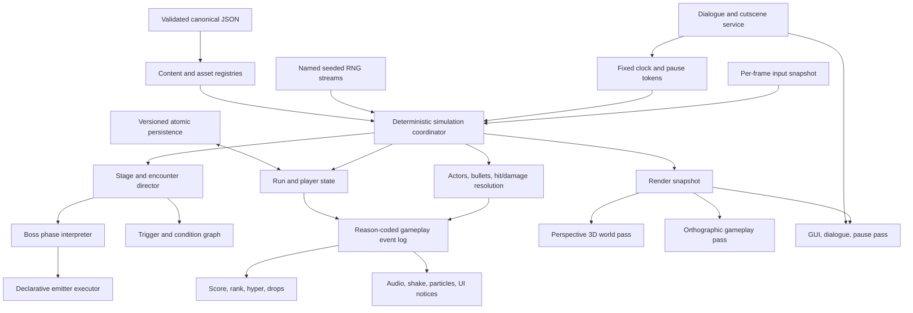

# Cross-Corpus System Blueprint

## Goal

Build Blade of Desires as a deterministic vertical shmup with 2D gameplay over 3D stage presentation, data-driven stages/bosses/dialogue, a single coherent run economy, explicit system ownership, versioned persistence, and tests at the behavior and scene level.

This is an adaptation design, not an implementation. Names describe responsibilities and may change in a future bounded issue.

## Current Blade product decisions

These explicit project decisions outrank suggestions inferred from the archive:

- The logical output is `640x360`. A centered `270x360` (`3:4`) gameplay plane at x `185..455` preserves the visual identity established by Selkies Moon; enemies and scenery may remain visible outside it, but enemies may fire only while their declared gameplay anchor/hurtbox is inside it.
- Gameplay is strictly a vertical-scrolling 2D shmup. Perspective 3D is presentation only.
- Maynii is the all-around ship, mixing dependable forward damage with tracking coverage. Ciela is the spread specialist. Kolar is the close-range specialist: fighting near targets is her primary strength, while dependable, meaningful ranged damage remains mandatory. This role cannot be interpreted as collision-only, melee-only, zero-range, or negligible-ranged gameplay; #23 owns her exact weapon form, melee use or non-use, emitters, option formation, cadence, damage, distance bands, and final balance.
- Boss phase breaks receive a readable recharge telegraph lasting roughly two seconds, with a Selkies-like ring presentation. Large bosses may lose parts as phase transitions and may replace, regrow, or transform parts in later phases.
- Ordinary enemy defeats should erupt into a generous burst of large, readable particles. Density remains accessibility-adjustable and cannot obscure dangerous bullets.
- Stage 1 is a high-quality, somewhat photorealistic pixel-art forest. Camera-facing 3D billboards render softly floating balls of light and other particles so crunchy textures remain attractive from the moving perspective camera.
- Ornate Selkies-like UI composition remains part of Blade's identity, though its motifs and exact layout should be re-authored for Blade.
- New artistic assets must use the governed editable/runtime asset pipeline. When Codex creates raster art, it uses proper image generation and deliberate pixel-art finishing; quick geometry-drawn stand-ins are not acceptable production art.

The Blade GDD is product authority. The archived `ai-gen-test`/assembled Blade slice was produced as a one-shot interpretation of that document. It is useful as a feasibility sketch, code-history snapshot, and defect catalogue, but it is not independent corroboration and does not make its tuning, schedule, or data model presumptively correct.

## Architectural principles recovered from the corpus

1. **One live authority per concern.** Selkies Moon's stage director is stronger than active timelines plus loose moment files; one input snapshot is stronger than objects polling keys independently.
2. **Content is data; behavior is code.** Stage schedules, ship profiles, difficulty, boss phases, dialogue, audio cues, and trigger conditions belong in canonical JSON.
3. **The simulation must be replayable.** A displayed seed is meaningless unless every gameplay RNG stream, input frame, clock, ID, and content version is controlled.
4. **Destruction is not defeat.** Offscreen culling, bomb cancellation, room cleanup, and HP defeat have distinct reasons and reward rules.
5. **Pause is owned, not guessed.** Dialogue, menus, boss transitions, Continue, and cutscenes acquire/release explicit tokens.
6. **Gameplay remains 2D.** The 3D world is presentation; collisions, bullets, player motion, and stage anchors use logical 2D coordinates.
7. **Imported libraries are boundaries.** Current `origin/dev@6b938aa` pins the exact GMTL v1.2 import with a fail-closed 20-root/47-file lock and keeps it read-only. The imported tree still has no retained MIT notice and its characterized false-green matchers are not repaired by the integrity lock; restore/verify the notice and guard those matchers in project-owned tests without modifying vendor bytes. Apply the same boundary if broad Input is adopted. See [the dependency analysis](gamemaker-3d-libraries-testing.md#dependency-boundary-for-current-blade).
8. **Every runtime asset has authority.** Canonical source, deterministic export, manifest mapping, provenance, and validation.
9. **Fail closed by declared requirement.** Unknown typed IDs, missing required packaged assets, invalid behavior data, and future save versions stop validation/play with a clear error. Only fields explicitly marked optional or development-only may diagnose and resolve to a deterministic placeholder.
10. **Characterize before extracting.** Old quirks become explicit fixtures before any rewrite decides whether to preserve them.

## Proposed system map



## Deterministic simulation kernel

### Fixed clock

- Simulation rate is exactly 60 ticks/second.
- The 60 Hz rate is part of the replay/content contract and cannot change mid-run. A real-time accumulator defines catch-up, maximum catch-up ticks, and overrun/drop behavior; headless tests can drive exact ticks without wall time.
- Presentation interpolation may vary; game rules use integer tick/time values.
- Stage time, player-state time, boss-phase time, and presentation time are separate clocks.
- A stage clock advances only when its declared blockers are absent.
- A 3D presentation clock may continue through boss dialogue when design requires moving scenery.
- Tests can accelerate presentation-only waits without changing gameplay cadence.

### Named RNG streams

Use one project-owned, versioned PRNG algorithm with specified integer width, seed derivation, and draw semantics. One run seed derives independent streams, for example:

- `stage_schedule`;
- `enemy_spawn_variant`;
- `pattern_geometry`;
- `drop_selection`;
- `cosmetic_effects`.

Cosmetic randomness must never advance gameplay streams. Stream derivation cannot depend on creation order; each stream exposes seed/state and draw count for replay diagnostics. No gameplay object calls ambient `random`, `irandom`, or `random_range` directly.

### Input snapshot

Poll once before normal Step and expose:

- movement vector;
- held/pressed/released action bits;
- device identity for prompts;
- optional analog values;
- simulation frame number.

Every gameplay object reads the same immutable snapshot. Replays store compact snapshots or action deltas, never platform key codes alone.

Poll platform devices once per presentation update. If the accumulator runs multiple simulation ticks, deliver pressed/released edges to exactly the first eligible tick, carry held/analog state to later catch-up ticks, and persist the resulting per-tick snapshots. This prevents an edge from repeating across catch-up ticks or disappearing between them.

### Stable IDs

Use stable content IDs for ships, enemies, encounters, phases, patterns, dialogue frames, checkpoints, triggers, audio cues, and assets. Use deterministic run-local IDs for instances, sweeps, bullets, damage events, and ownership.

Names shown to players are presentation data and may change without invalidating saves/replays.

### Tick phases

A central coordinator should make ordering explicit:

1. Poll/apply input snapshot.
2. Resolve pause/overlay ownership and accepted commands.
3. Advance run/stage/encounter state.
4. Execute player, enemy, and boss decisions.
5. Emit movement and shot intents.
6. Integrate movement.
7. Collect collision candidates.
8. Sort and resolve hits/cancellation deterministically.
9. Apply defeat/cleanup reasons and generate gameplay events.
10. Apply score/rank/hyper/drop policy from events.
11. Dispatch presentation effects.
12. Commit cleanup and render snapshot.

This helps prevent behavior from depending on arbitrary instance creation order or Draw events. Within each phase, iterate stable IDs, buffer cross-entity intents, declare deterministic tie-breakers, and commit cleanup in stable order; phases alone do not make shared mutation deterministic.

## Pause, cutscene, and modal ownership

Replace global booleans and mass instance deactivation with tokens:

| Owner | Typical freeze domains |
|---|---|
| Pause menu | gameplay, stage, boss; not menu/UI |
| Dialogue | player combat, enemies, stage schedule; optionally not 3D presentation |
| Boss intro/outro | stage schedule and ordinary spawns |
| Continue | gameplay and stage; Continue UI remains active |
| Visual QA/test | declared domain only |

Each token has owner ID, reason, domains, acquisition frame, and release rule. Releasing one token cannot resume a domain still held by another. Owner destruction, room exit, abort, and load have explicit release/transfer policy; diagnostics report leaked tokens, unknown releases, and domains held beyond their expected lifetime.

Cutscenes are sequences over the live scene:

- acquire tokens;
- move camera/actors by named anchors;
- run dialogue;
- signal/activate content;
- release tokens;
- restore declared state.

This adapts Shale's suspended-live-scene benefit without relying on Godot tree removal.

## Canonical content layout

Suggested families:

```text
content/
  schema/
  ships/
  difficulties/
  stages/
  encounters/
  enemies/
  patterns/
  dialogue/
  cutscenes/
  triggers/
  audio/
  save/
```

Every file declares schema version and stable ID. Repository tooling validates references and uniqueness without launching GameMaker.

`content/save/` holds repository-owned schema, default, and migration definitions only. Mutable player config, save, checkpoint, and replay payloads live in GameMaker's per-user storage and are never packaged-source authority.

### Ship profile

Define profiles from the GDD and current product decisions rather than inheriting the archived one-shot prototype's tuning:

- focused/unfocused speed;
- main/option damage;
- option forward/side/arc placement;
- option turn response;
- hyper drain/modifier;
- hitbox and graze radii;
- normal/focused emitter IDs;
- bomb and hyper presentation IDs.

Object code consumes one normalized profile. It does not branch on ship name.

- Maynii combines forward damage with tracking coverage and is the baseline all-arounder.
- Ciela emphasizes broad field coverage and spread geometry.
- Kolar's close-range-specialist role and mandatory meaningful ranged damage are fixed, but implementation must not invent or freeze her exact weapon, melee use or non-use, emitters, option formation, cadence, damage, distance bands, or final balance before #23. A deterministic swept-melee experiment remains a non-binding candidate only.

### Difficulty profile

Store enemy speed/HP, boss HP, rank gain/cap, score multiplier, bullet density/speed, and optional practice limits. Clamp and validate each range. Difficulty selects parameters; it does not duplicate entire stage files.

### Stage schedule

Author Blade's schedule from the GDD's story and new playtesting. Use THPJ3, Selkies, Faewind, and the legacy ports as pacing/grammar evidence; the archived Blade 12-row schedule is only a disposable format example:

```json
{
  "at": 330,
  "event": "spawn_wave",
  "encounter_id": "stage1.wave_03",
  "anchor": "lane.top_center",
  "formation": "wave_plus_shotgun",
  "repeat": 1
}
```

Support event types such as spawn wave, dialogue/cutscene, music cue, background route, boss, stage clear, and trigger toggle. Named anchors replace raw room coordinates. A linter reports overlap, dead air, unreachable events, unknown references, and stray events after clear.

## Player combat

### Movement and focus

- Normalize diagonal movement.
- Clamp the player and active gameplay entities to the centered `270x360` plane inside the `640x360` logical output.
- Focus changes speed, hitbox presentation, and emitter/option formation.
- Keep input velocity separate from external displacement/recoil, adapting Shale's two-source velocity model.
- Resolve forced movement and collision in a documented order.

### Options and emitters

Option drones use data-defined anchor curves relative to player, smoothly interpolating between focused/unfocused geometry. They emit from stable muzzle IDs rather than hard-coded `instance_create` offsets.

The abandoned THPJ3 “Z and C both shoot right” behavior should not survive. Actions receive explicit names and bindings.

### Weapon-mode vocabulary

Use data to support, per ship or weapon:

- normal versus focused formation;
- manual fire versus autofire;
- optional tap-versus-hold transformation inspired by Faraii;
- laser/beam with line/rectangle collision and explicit hit rate;
- radial, fan, homing, flame, missile, or sword-sweep emitters;
- ammo/cooldown/meter costs.

Do not force every prototype mechanic onto every ship. The common executor supports them; ship content chooses a coherent subset.

### Swept melee/beam hits

Adapt Selkies' sweep IDs:

- one attack activation gets one stable attack ID;
- each target records IDs already applied;
- a continuous beam declares whether damage is once, once per interval, or every tick;
- collision geometry is sampled/swept deterministically;
- hit events carry source, target, attack, damage, frame, and reason.

## One hyper economy

Honor Blade's three-tier design while keeping Selkies' “one visible resource” discipline.

Recommended starting contract:

- range `0..300`;
- activation requires at least 100;
- spending 100/200/300 selects tier 1/2/3 or consumes the current whole meter by explicit policy;
- activation performs one bullet-cancel event and grants a short invulnerability seam;
- tier controls duration, attack transformation, score multiplier, and pressure cost;
- higher tier may accelerate enemy cadence/bullets as the archived risk/reward idea, but through central rank/pressure policy;
- emergency activation during the deathbomb window follows a separately tested resource rule;
- meter gain uses reason-coded events: graze, hit, close-range hit, medal/drop, boss phase, passive trickle.

Exact threshold 100 must be usable. No second hidden cancel meter. UI shows sources, tier, duration, and danger/pressure clearly.

## Bomb, death, and Continue

- Bomb command validates stock/state, consumes exactly once, creates a timed cancel/damage field, and grants declared invulnerability.
- Deathbomb window is an explicit player state/timer, not inferred from an alarm.
- Emergency success and normal death have separate events.
- Death resets resources according to one run policy and cannot award defeat/cleanup score.
- Continue is an explicit modal state with accept/decline commands and run-stat consequences.
- Practice never contaminates persistent normal-run stats and may define different terminal behavior.

## Combat entity model

### Identity and ownership

Every projectile/attack has:

- run-local ID;
- faction/team ID;
- owner entity ID;
- attack/emitter ID;
- damage payload;
- cancellation power/penetration;
- graze eligibility and grazed-player bitset;
- spawn frame and lifetime;
- cleanup reason.

Original/clone/familiar allies share faction rules while retaining distinct owners.

### Hitbox, hurtbox, and damage payload

Clean-room adapt Shale's separation:

- hit geometry discovers candidates;
- damage payload describes amount/type/knockback/falloff/status;
- hurtbox enforces faction, invulnerability, recent-hit, and status-shell policy;
- health applies final integer/fixed-point changes;
- presentation listens to the resulting event.

No object awards score directly inside Destroy or collision code.

### Projectile penetration/cancellation

Integer cancellation strength can unify:

- player-shot versus enemy-shot cancellation;
- blade/diamond/bead hierarchy;
- bombs and sword sweeps;
- shields/barriers;
- piercing enemies;
- boss phase break effects.

Pair resolution must be symmetric, deterministic, and reason-coded. Equal strength behavior is specified, not incidental. High-speed shots use swept or bounded substep collision.

### Status shells

Adapt Shale's freeze shell into a generic layer:

- shell has type, health/duration, collision changes, damage partition, and break event;
- examples: barrier, armor, stagger, freeze, ward, spell shield;
- applying the same shell is idempotent or explicitly stacks;
- subscriptions/cleanup are owned once.

## Enemy and encounter architecture

### Enemy specifications

Adapt Selkies' identity-plus-role model:

- visual identity/content ID;
- role: chaser, anchor, dancer, lancer, shooter, support;
- movement descriptor;
- emitter/pattern set;
- health/reward/drop policy;
- visibility/fire telegraph rules;
- offscreen lifecycle.

An enemy may be rendered in the 3D/gutter composition before entering the gameplay plane. Its movement and telegraph may advance there, but every attempted emission checks the declared gameplay anchor/hurtbox and remains fire-locked while it is outside. Re-entry may resume or restart cadence according to an explicit content rule; it never permits firing from outside the plane.

One parent/controller owns freeze, damage, defeat, reward request, and cleanup. Child/role logic stops immediately when the parent blocks combat.

### Encounter ownership

Replace Sunflowers' global `instance_number(obj_enemy_parent)==0` gates with encounter IDs:

- encounter owns spawned entity IDs;
- gates listen to that encounter's state;
- unrelated enemies cannot open/hold the gate;
- completion is signaled exactly once;
- persistent trigger keys can record completion when desired.

### Trigger/Activator graph

Clean-room adapt Shale:

- Trigger is a stable logical source.
- Conditions support all, any, exactly one, none, sequence, threshold, and flag.
- Activator publishes state; visual/collision/music/spawn listeners remain separate.
- Initialization is two-phase: load all trigger state, then evaluate/signals.
- Keys come from a validated registry, not free-form runtime strings.

This can drive doors, vulnerability windows, alternate stage routes, tutorial prompts, boss attacks, or story flags.

## Pattern executor

Convert THPJ3's 13 switch cases, Selkies' boss descriptors, and characterized GM8.1 specimens from TMoLaD, Tiny Girl, Split+Balance, and The Ghost Who Wants to Be Alone into one declarative emitter vocabulary:

- stream;
- aimed wave/fan;
- shotgun and speed tiers;
- lane;
- random burst using named RNG stream;
- ring and random-position ring;
- horizontal/vertical wall;
- forward spray;
- lane/shotgun/stream ring composites;
- spiral, redirect, cross, chevron, orbit, beam, and summon as explicit operators.

A descriptor declares origin/anchor, aim source, count, angle/spread, speed tiers, cadence, friction/acceleration, rotation, redirect, repeats, bullet kind, cancellation power, and theme.

Composite patterns invoke validated child descriptors. They never assume a literal room layer or singleton player.

Characterization must preserve the template's known spawn cardinalities before refactoring. Random patterns test both count/invariants and seeded golden sequences.

The first legacy expansion fixtures should cover a Tiny Girl opposing-socket fan, TMoLaD's decelerate-then-child-burst lifecycle, Split+Balance's counter-rotating themed channels, and Ghost's rotating N-way boss fan plus symmetric wave grammar. Ghost's defeat-only `1 -> 3 -> 9` splitting lineage belongs in lifecycle/encounter characterization alongside those shot fixtures. Their geometry is reusable; alarms, shared globals, Draw-time simulation, ambient RNG, and Destroy-owned rewards are not.

## Boss and multi-boss director

### Encounter state machine

Use the archived THPJ3 handshake with stricter ownership:

```text
prepare
  -> approach
  -> dialogue
  -> charge
  -> active phase
  -> phase break (repeat)
  -> outro dialogue
  -> complete
```

The encounter director—not the boss object—owns stage pause tokens, ordinary-enemy cleanup policy, music transitions, boss entity IDs, HUD registration, and completion.

Every phase transition includes an explicit break/recharge state. The default presentation lasts about two seconds and uses a readable expanding or charging ring before vulnerability and firing resume. Content and difficulty may tune it within a bounded couple-second range, but no difficulty may eliminate the telegraph.

### Phase descriptors

Each phase has stable ID, title, HP, timeout, movement track, attack descriptors, cadence/rank policy, vulnerability/trigger conditions, theme/audio, and next transition. Unknown attack IDs fail closed.

Use Selkies' plan signatures to characterize plan identity/uniqueness; separately validate transition-graph reachability and execute every phase in director tests. Use File Cypher's deterministic sequence/completion handshake and vulnerability/stagger gates. Use THPJ3's approach/chat/charge/active presentation. Use TMoLaD/GMC3's many-phase formula ideas only where they survive characterization.

### Multi-boss encounters

Adapt Selkies' sisters contract:

- encounter registry owns participants;
- independent personal phases/HP/HUD slots;
- defeated participant becomes harmless by explicit state;
- shared finale has one shared life pool and synchronized damage;
- completion waits for the encounter, not global boss count.

This also supports familiars, destructible parts, linked shields, or alternate targets.

For large bosses, parts are encounter-owned actors with explicit attachment, health, defeat, replacement, and reward policies. Destroying a declared part may complete the current phase. The next phase may expose a new body state, attach replacement parts, regrow altered parts, or transform the boss; ordinary cleanup may never trigger those transitions or rewards.

## Score, rank, graze, and rewards

### Reason-coded event log

Every score/resource change comes from an event such as:

- enemy defeated;
- boss phase broken;
- bullet cancelled;
- bullet grazed first time;
- item collected;
- stage cleared;
- timeout/no-miss bonus;
- bomb used;
- death;
- continue.

Events include IDs/frame/values and can be audited in replay tests. Offscreen/scene cleanup cannot impersonate defeat.

### Graze once

Each bullet tracks which eligible player entity has grazed it. First entry awards; remaining inside the radius does not repeatedly award. Re-entry policy is explicit. Bomb/cleanup destruction never creates graze/defeat score.

### Rank

Use one bounded value converted centrally into pressure multipliers, adapting Selkies. Rank effects and gain/loss reasons are content/policy, not scattered in enemies. Practice can set/lock rank. Replays record starting profile and resulting events.

### Arithmetic

Prefer integers or defined fixed-point units for score, point value, multiplier, and meter. Avoid a multiplier that decrements through fractional values and relies on equality with zero.

## Dialogue and cutscenes

Combine:

- the shared runtime's normalization, ADV/narration/NVL/silent modes, view-relative actors, audio/voice/music/background, auto, log, and save resume;
- Selkies' stable route/seam filenames and deterministic placeholders for explicitly optional/development dialogue assets;
- Shale's ordered cutscene-step queue and accelerated test clock;
- THPJ5's save-slot/menu/backlog presentation.

Canonical frames need stable IDs, localization keys, choices, conditions/effects, typed asset IDs, and schema validation. Services inject input/audio/save/log/asset resolution. Raw keyboard polling and dynamic resource-name lookup stay out of content rendering.

Cutscene steps should include dialogue, wait, camera track, actor motion, animation, music/audio cue, trigger command, encounter command, fade, and signal.

## Save, config, practice, and replay

Separate files/contracts:

- player config and bindings;
- career/unlock/high-score data;
- optional suspended run/checkpoint data;
- replay header/input stream.

Each has schema version, fresh default, validation, known migrations, future-version rejection/backup, atomic temp-write/replace, and corruption fallback. Tests use isolated filenames.

Stable IDs replace room-order indices and scene paths. Preview images have one owner and explicit disposal.

Replay header should include game/schema version, content manifest hash, PRNG algorithm/version, run seed, difficulty, ship/loadout, starting practice/run data, tick rate, and accumulator/overrun policy. Playback verifies periodic state hashes and reports the first divergent frame/system. Hash input uses a canonical platform-independent field order and integer/fixed-point or explicitly quantized numeric encoding; it never hashes engine memory layout, map iteration order, or unnormalized floating-point bytes.

## Audio and feedback

Adapt Shale's priority music stack and Selkies' semantic cue helpers:

- priorities such as ambience, stage, boss, dialogue, preview;
- lower layers fade/pause and resume within a grace period;
- stop/null are explicit commands;
- named interactive sections are content data;
- zero-duration transitions are defined;
- one owner controls each bus/group gain.

Gameplay emits semantic effects—enemy hit, deep hit, graze, cancel, phase break, bomb, death, menu—not raw sound IDs.

Central feedback commands own shake, hit stop, vignette, flash, low-pass/muffle, and particles. Ordinary enemy defeat defaults to a conspicuous burst of large particles, while commander, phase-break, part-loss, and boss effects scale severity further. Accessibility settings can independently limit shake, flash, time scale, and particle density without removing gameplay tells.

## Rendering and asset pipeline

### Passes

1. World pass: perspective 3D, lights/fog/camera-facing billboards, shared VBUFF registry.
2. Gameplay pass: orthographic `640x360` output with centered `270x360` active plane, deterministic actor/bullet/effect hierarchy.
3. GUI pass: gutters, boss phases, resources, dialogue, pause, accessibility.

Each pass sets and restores all matrices, depth, blend, shader, color, alpha, and target state it owns.

Stage 1 uses camera-facing billboard particles for gently floating balls of light in the perspective forest. Billboard instances have bounded counts, deterministic presentation-only drift, explicit blend/depth state, and a shared texture/material; they never enter gameplay collision or replay state.

### Offline 3D

`.blend -> .obj/.mtl -> validated .vbuff`, with retained interchange, source/output hashes, converter version, bounds/count metadata, and manifest entry. Runtime never parses OBJ for normal stage assets.

### Art/audio

Use archived assets as style/cue references until creator, license, editable source, and original-IP fit are established. Re-author Touhou/Neuro/team/third-party material. Follow the current repository's KRA/SVG/Logic/MIDI/Blend source rules and runtime formats.

The Stage 1 forest targets high-quality, somewhat photorealistic pixel art rather than primitive debug shapes. Generated raster concepts/assets use the image-generation workflow, are deliberately finished into coherent pixel art, retain editable `.kra` authority, and export governed `.png` runtime derivatives. Quick rectangles, circles, gradients, or other geometry-drawn substitutes may be temporary diagnostics only and cannot satisfy production-art acceptance. The ornate UI follows the same authored-asset standard.

## Testing ladder

### Headless repository/content tests

- JSON schema and cross-reference validation;
- unique IDs and no unreachable pattern/phase/cutscene steps;
- stage dead-air/after-clear lint;
- asset manifest/source/runtime mapping;
- model conversion metadata and golden hashes;
- dependency lock integrity.

### GameMaker characterization tests

- exact emitter cardinalities and seeded geometry;
- input snapshot edges and device parity;
- pause token composition;
- player state/deathbomb/hyper exact thresholds;
- graze once and cleanup reason rewards;
- penetration/cancellation pair matrix;
- boss phase and multi-boss transitions;
- encounter-owned gates;
- dialogue normalization/errors and cutscene progression;
- save migration/corruption/atomic failure;
- buffer and surface cleanup.

### Scene/integration tests

Adapt Shale's fixed-rate fixture lessons:

- fixed 60 Hz;
- nonparallel engine fixture where global state requires it;
- accelerated presentation-only waits;
- real room/controller interactions;
- isolated saves;
- deterministic replay golden runs;
- no dependence on GUI/manual timing.

### Hosted runtime evidence

Use hosted/headless GameMaker validation under the repository's governed change flow. Static declarations and historical logs are never substituted for fresh exact-candidate evidence.

## Suggested implementation order

The single documented proposed issue order is maintained in the [extraction matrix](extraction-matrix.md#proposed-issue-sequence). Its first five proposed issues deliberately establish, in order: Blade's current content contracts; the deterministic clock/RNG/input/replay-event kernel; run/pause/persistence ownership; damage/projectile/cleanup and the in-plane firing gate; then the declarative emitter executor with THPJ3 cardinalities and seeded TMoLaD, Tiny Girl, Split+Balance, and Ghost trajectory fixtures. This archaeology does not create or authorize those issues.

Later issues layer stage/boss direction, Maynii and Ciela, scoring/economy, perspective/orthographic rendering, dialogue/persistence/replay, and production assets onto those foundations. Every issue must remain bounded, include proportionate characterization tests, and avoid importing an entire jam project as a shortcut.
